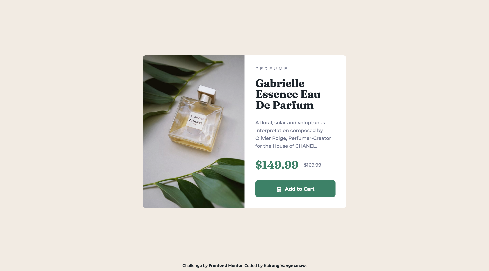
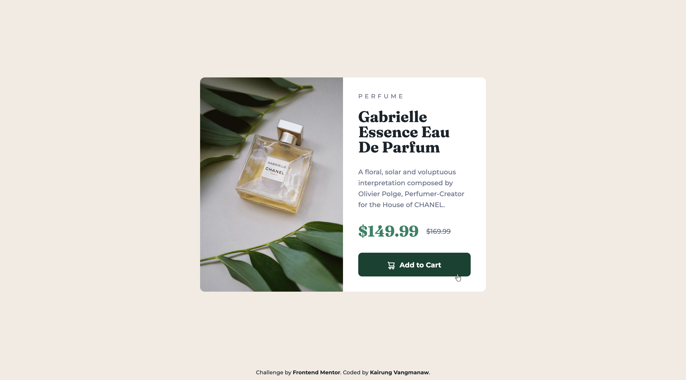

# Frontend Mentor - Product preview card component solution

This is a solution to the [Product preview card component challenge on Frontend Mentor](https://www.frontendmentor.io/challenges/product-preview-card-component-GO7UmttRfa). Frontend Mentor challenges help you improve your coding skills by building realistic projects. 

## Table of contents

- [Frontend Mentor - Product preview card component solution](#frontend-mentor---product-preview-card-component-solution)
  - [Table of contents](#table-of-contents)
  - [Overview](#overview)
    - [The challenge](#the-challenge)
    - [Screenshot](#screenshot)
    - [Links](#links)
  - [My process](#my-process)
    - [Built with](#built-with)
    - [What I learned](#what-i-learned)
    - [Continued development](#continued-development)
    - [Useful resources](#useful-resources)
    - [AI Collaboration](#ai-collaboration)
  - [Author](#author)
  - [Acknowledgments](#acknowledgments)

## Overview

### The challenge

Users should be able to:

- View the optimal layout depending on their device's screen size
- See hover and focus states for interactive elements

### Screenshot

  
Mobile view

  

  
Desktop view

  

  
Active state view

  

### Links

- Solution URL: [Product Preview Card Component using React, BEM & Modern CSS](https://your-solution-url.com)
- Live Site URL: [Frontend Mentor | Product preview card component](https://challenged-by-frontend-mentor.github.io/product-preview-card/)

## My process

### Built with

- [Semantic HTML5](https://developer.mozilla.org/en-US/docs/Glossary/Semantics#html_semantics) markup
- [BEM Methodology](https://getbem.com/) for clean CSS class naming
- CSS custom properties (Variables)
- Flexbox & [CSS Grid](https://developer.mozilla.org/en-US/docs/Web/CSS/CSS_grid_layout)
- Mobile-first responsive workflow
- [<picture> HTML Element](https://developer.mozilla.org/en-US/docs/Web/HTML/Reference/Elements/picture) for art direction
- [React](https://react.dev/) - JS Library
- [Vite](https://vitejs.dev/) - Frontend Build Tool
- [Google Fonts](https://fonts.google.com/) - Fraunces & Montserrat

### What I learned

In this challenge, I refined my workflow to be faster, more structured, and required significantly fewer refactoring iterations:

- **Art Direction with `<picture>`**: Implemented the `<picture>` element with standard media queries to seamlessly swap desktop and mobile assets without unnecessary JS logic.
- **Enhanced Accessibility (a11y)**: Learned how to properly structure accessible price screen-reader announcements using `.sr-only` CSS alongside semantic tags like `<del>` for original price indicators.
- **Focus State Management**: Enhanced interactive accessibility on action elements like buttons using `:focus-visible` with dedicated outline offsets.
- **BEM in React**: Kept CSS classes clean, modular, and maintainable across React components without class collisions.

### Continued development

For upcoming projects, I plan to:
- Experiment with utility-first CSS frameworks like Tailwind CSS to speed up basic styling workflows even further.
- Explore automated end-to-end testing tools (like Playwright) for visual regression testing across different viewports.
- Continue sharpening accessible web design standards and keyboard navigation experiences.

### Useful resources

- [<picture> Element - MDN](https://developer.mozilla.org/en-US/docs/Web/HTML/Reference/Elements/picture) - Essential reference for setting up responsive image art direction.
- [`<s>` Element - MDN](https://developer.mozilla.org/en-US/docs/Web/HTML/Reference/Elements/s) - Useful guide on representing content that is no longer accurate or relevant.
- [`< del >` Element - MDN](https://developer.mozilla.org/en-US/docs/Web/HTML/Reference/Elements/del) - Helped in properly marking up original strike-through prices for semantic accessibility.

### AI Collaboration

- **Gemini & Google Search AI Mode**: Used for code reviews, refining BEM syntax consistency, auditing accessibility (a11y) standards, and verifying SEO meta tags.

## Author

- GitHub: [Kairung Vangmanaw](https://github.com/VangmanawKairung)
- Frontend Mentor - [@VangmanawKairung](https://www.frontendmentor.io/profile/VangmanawKairung)

## Acknowledgments

I want to express my deepest gratitude to myself for staying dedicated and constantly improving my craft, as well as to my family for their unwavering support. A big thank you to the Frontend Mentor team for creating such well-structured challenges that bring real-world practice to developers. I'm also thankful for all the powerful development tools that made this workflow seamless—including the macOS Preview app, which allowed me to quickly inspect exact pixel dimensions from design specs instead of relying solely on trial and error, greatly speeding up my development pace.
